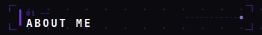
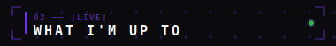
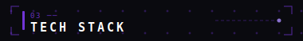
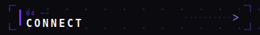
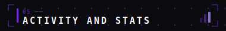
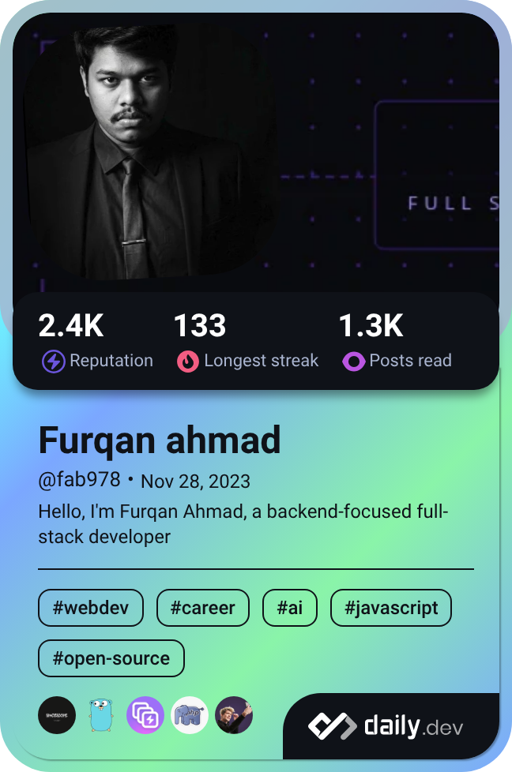

  <!--  -->
  

 
 
 

 
 

 

  

 

> 1.  Exploring new technologies and continuously learning to improve backend and full-stack development skills.
>
> 2.  Studying system design concepts including distributed systems, caching, and queues, with a focus on thinking in systems rather than just features.
>
> 3. Staying consistent and focused on long-term growth by building and learning every day.

 
 

 
 
 

 
 

<code>01 ─ Frontend</code>

  

<code>02 ─ Backend</code>

  

<code>03 ─ Databases & Caching</code>

  

<code>04 ─ DevOps & Tools</code>

  

 
 
 

 
 

  
  
  
  
  

 
 
 
 

 
 

<table align="center" width="100%" cellpadding="0" cellspacing="0">
  <tr>
    <td width="70%"  align="left">
    
    </td>
    <td width="35%"  align="right">
      
    </td>
  </tr>
</table>

 

  

 

  

 

  

 
 
 
 

  

 

