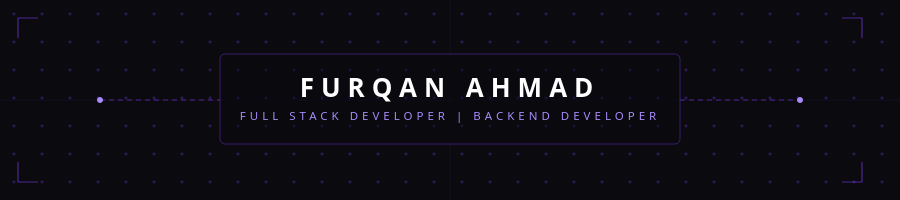
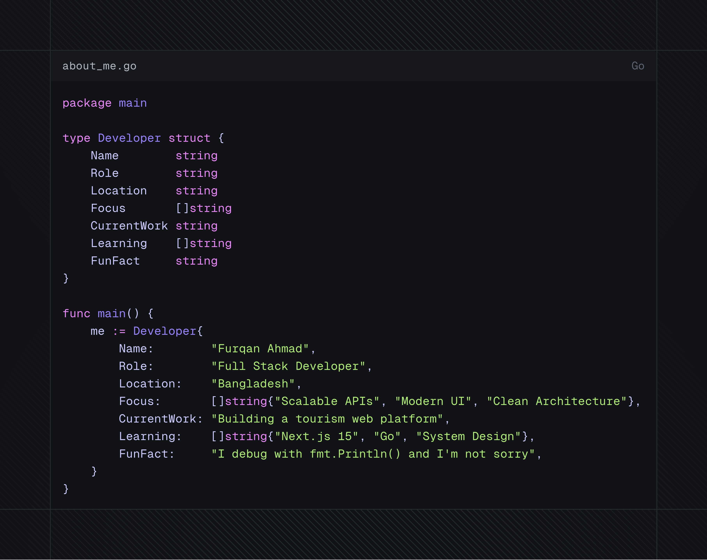
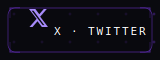
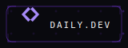
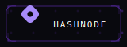
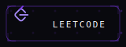
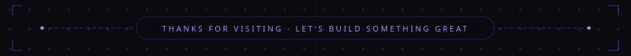

  <!--  -->
  

 

 

`[LIVE] What I'm Up To`

- Exploring — Diving deep into **Next.js 15** App Router & Server Components
- Building — A full-featured **tourism website** with real-time booking, maps & reviews
- Learning — **Go** for high-performance backend services
- Experimenting — **GraphQL subscriptions** + **Redis pub/sub** for live data
- Open to — Collaborating on meaningful open-source projects

 

`import { TechStack } from @common/furqan`

`01 ─ Frontend`

  

`02 ─ Backend`

  

`03 ─ Databases & Caching`

  

`04 ─ DevOps & Tools`

  

 

`// connect`

  
  
  
  
  

 
 
 
 

<table align="center" width="100%" cellpadding="0" cellspacing="0">
  <tr>
    <td width="70%"  align="left">
    
    </td>
    <td width="35%"  align="right">
      
    </td>
  </tr>
</table>

 

  

 

  

 

  

 
 
 
 

  

 

