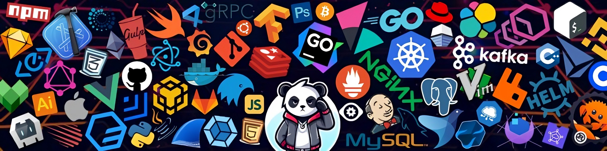

<!-- Cover Image at the top -->

  

 
 
 
 

<!-- Daily.dev Dev Card -->

<table align="center" width="100%" cellpadding="0" cellspacing="0">
  <tr>
    <td width="80%"  align="left">
    
    </td>
    <td width="20%"  align="center">
      
    </td>
  </tr>
</table>

 
 

  

 
 
 

  

 
 
 

  <em>“Code is like humor. When you have to explain it, it’s bad.” – Cory House</em>

