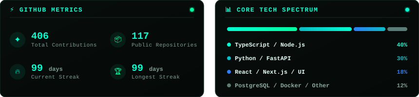

<div align="center">



</div>

<br/>

<table align="center">
  <tr>
    <td></td>
    <td></td>
  </tr>
</table>

<br/><br/>

<div align="center">

Full Stack &amp; Backend Developer focused on building reliable APIs, scalable backend systems, and modern web applications.
I work primarily with **React**, **TypeScript**, **Node.js**, **NestJS**, **FastAPI**, **PostgreSQL**, and **Docker** — turning ideas into production-ready software.

~10 months of professional backend and full-stack development experience. Always learning, always building.

</div>

<br/><br/>

<div align="center">
<h3><code>Contributions</code></h3>
<br/>

</div>

<br/><br/>

<div align="center">
<h3><code>Featured Projects</code></h3>
</div>

<br/>

<table align="center">
<tr>
<td width="50%" valign="top">

###  Do.Quests


> A quest management app focused on small tasks for task creators and task submitters, making task completion and rewards easier and smoother.

**Tech:** `Next.js` · `shadcn/ui` · `TypeScript` · `NestJS` · `MongoDB` · `@nestjs/mongo` · `class-validator` · `Stripe`

[`Frontend`](https://github.com/furqanRupom/do-quest-frontend) · [`Backend`](https://github.com/furqanRupom/do-quest-backend)

</td>
<td width="50%" valign="top">

###  Content Forge AI


> An application built for content creators who want to create content easily and affordably.

**Tech:** `Next.js` · `shadcn/ui` · `TypeScript` · `Express.js` · `PostgreSQL` · `Prisma ORM` · `better-auth`

[`Frontend`](https://github.com/furqanRupom/content-forge-frontend) · [`Backend`](https://github.com/furqanRupom/content-forge-backend)

</td>
</tr>
<tr>
<td width="50%" valign="top">

###  Dise API

<p>


</p>

> A FastAPI backend for a platform-owned car rental service.

**Tech:** `Python` · `FastAPI` · `SQLAlchemy` · `Alembic` · `PostgreSQL` · `Docker`

[`Repository`](https://github.com/furqanRupom/dise-api)

</td>
<td width="50%" valign="top">

<div align="center">

<br/>

```
$ git log --oneline -1
🔨 wip: next_project.ts

$ status
🟢 in active development
```

<br/>

</div>

</td>
</tr>
</table>

<br/><br/>

<div align="center">
<h3><code>Tech Arsenal</code></h3>
</div>

<br/>

<div align="center">

**`Backend`**


<br/><br/>

**`Frontend`**


<br/><br/>

**`Database`**


<br/><br/>

**`ORM / Data`**


<br/><br/>

**`DevOps / Tools`**


</div>

<br/><br/>

<div align="center">
<h3><code>What I'm Up To</code></h3>
</div>

<br/>

<div align="center">

| Area                   | Details                                                                                             |
| :--------------------- | :-------------------------------------------------------------------------------------------------- |
| **Currently Building** | Backend and full-stack applications with REST APIs, FastAPI, Node.js, NestJS, PostgreSQL and Docker |
| **Learning**           | NestJS, C# / .NET, Redis, system design, advanced backend architecture, AI/LLM applications         |
| **Exploring**          | Vector databases, AI-assisted development and modern backend architecture                           |
| **Goal**               | Become a stronger backend/full-stack software engineer                                              |

</div>

<br/><br/>

<div align="center">
<h3><code>GitHub Stats &amp; Activity</code></h3>
<br/>



<br/><br/>


</div>

<br/><br/>

<div align="center">
<h3><code>GitHub Achievements</code></h3>
<br/>

<table align="center">
  <tr>
    <td align="center" width="160">
      <a href="https://github.com/furqanRupom?tab=achievements">
        
        <br/>
        <sub><b>Pull Shark</b></sub>
      </a>
    </td>
    <td align="center" width="160">
      <a href="https://github.com/furqanRupom?tab=achievements">
        
        <br/>
        <sub><b>YOLO</b></sub>
      </a>
    </td>
    <td align="center" width="160">
      <a href="https://github.com/furqanRupom?tab=achievements">
        
        <br/>
        <sub><b>Quickdraw</b></sub>
      </a>
    </td>
  </tr>
</table>

</div>

<br/><br/>

<div align="center">
<h3><code>Connect</code></h3>
<br/>

[](https://github.com/furqanRupom)
[](https://www.linkedin.com/in/furqan-ahmad-rupom/)
[](https://x.com/ahmad288140)
[](https://www.instagram.com/fab_w00/)
[](https://www.facebook.com/fab.rupom)
[](mailto:furqanrupom978@gmail.com)
[](https://furqan-ahmad.vercel.app/)

</div>

<br/><br/>

<div align="center">


<br/>

`Scan to visit my portfolio`

</div>

<br/><br/>

<div align="center">

</div>
